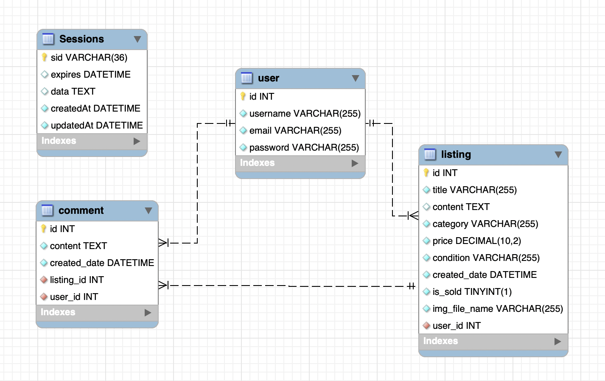
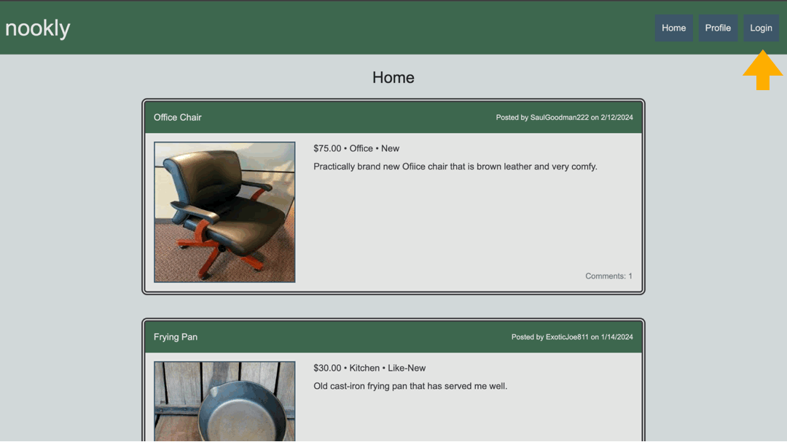

# Nookly: Recycle Home Items 

## Description 

Unlock the value of your unwanted household items with Nookly: Recycle Home Items.  

Nookly is an application that follows the MVC paradigm in its architectural structure, using Handlebars.js as the templating language, Sequelize as the ORM, and the express-session npm package for authentication. 

Our platform connects sellers with buyers that are passionate about sustainability and creating a seamless marketplace for recycling within your community. Join us in reshaping the way we think about decluttering!

This project defines 3 Sequelize models and utilizes the `express-session` model: 
1. `User`
2. `Listing`
3. `Comment`

The database is mapped according to the following schema:  

## Table of Contents 
- [Installation](#installation)
- [Dependencies](#dependencies)
- [Usage](#usage)
- [Testing](#testing)
- [Contributing](#contributing)
- [License](#license)
- [Questions](#questions)
  
## Installation 

There is no installation necessary as it is deployed to Heroku. You can visit the deployed application [here]() and try it out! 

If you would like to run the application locally, use the following steps:
1. Clone this repository to your local machine. (For reference, visit the [Cloning a Repository](https://docs.github.com/en/repositories/creating-and-managing-repositories/cloning-a-repository) GitHub Docs article.)
2. Run `npm install` in your CLI to download the npm package dependencies. 
3. Run `mysql -uroot -p` in your CLI and log into MySQL.
4. Run `source db/schema.sql` to create the database on your local machine.
5. Exit out of MySQL by running `exit`.
6. Run `npm run seed` in the root directory to seed the database.
7. Run `npm run start` to sync the Sequelize models to the MySQL database and start the server.
8. Open `http://localhost:3001` in your local browser. 
  
## Dependencies
This project requires the following npm package dependencies:
1. [bcrypt](https://www.npmjs.com/package/bcrypt)
2. [connect-session-sequelize](https://www.npmjs.com/package/connect-session-sequelize)
3. [dotenv](https://www.npmjs.com/package/dotenv)
4. [express](https://www.npmjs.com/package/express)
5. [express-handlebars](https://www.npmjs.com/package/express-handlebars)
6. [express-session](https://www.npmjs.com/package/express-session)
7. [multer](https://www.npmjs.com/package/multer?activeTab=readme)
8. [mysql2](https://www.npmjs.com/package/mysql2)
9. [sequelize](https://www.npmjs.com/package/sequelize)

## Usage 

The animation gif below demonstrates the app's functionality:  
  

### Home Page Usage
- The user will see listings on the Home page that are not sold yet 
- The user will be able to click each listing to expand it and view comments 
    - Once the user is logged in, they will be able to add comments of their own under listings 
- Each listing will have a comment count displayed to show the user how much attention the listing is getting

### Profile Page Usage 
- Once logged in, the user will be able to access their profile, where listings they have created will appear 
- Clicking the 'New Listing' button will render a card that prompts the user to enter information about their new listing, as well as an image 
- Once the listing is created, the user may click on each lisiting in their profile to update or delete it 
    - If the user marks the listing as sold, there will be a 'SOLD!' indicator on the corresponding post 
    - Once a listing is marked sold, it will be removed from the Home page

### Login Page Usage 
- The user will have the option to login if they already have an account, or press the `Sign Up Instead` to create an account
- Once logged in, the user will be redirected to their Profile page
    - They will then be able to create new listings in the Profile page and add comments in the home page
- The user will be alerted with an error if their credentials are incorrect 

### Sign Up Page Usage
- The user will be able to create an account by filling all fields for the username, email, and password
- If the user already has an account, they can press the `Login Instead` button to be redirected to the login page
- Sign up will fail if the user doesn't enter a valid email or a password over 8 charaters long

## Testing 
No test suites have been written for this application. The API routes were tested locally during development with the [Insomnia](https://docs.insomnia.rest/) development platform.  

Please refer to the [Installation](#installation) section if you are interested in running and testing the application locally.

## Contributing
To make contributions to this project:  
1. Fork the repository  
2. Make some commits to improve the application
3. Open a Pull Request on GitHub
4. From there, we can discuss your changes and merge the pull request once your contributions have been approved!

## License 
This GitHub repository is licensed under the MIT license. Please refer to the license documentation [here](https://opensource.org/licenses/MIT).
  
## Questions
This project was developed by the following contributors: 
1. [dymoy](https://github.com/dymoy)
2. [Domj1204](https://github.com/Domj1204)
3. [JaronG548](https://github.com/JaronG548)
2. [H3Xivall](https://github.com/H3Xivall)

For any related questions, please contact me via email at <derekymoy@gmail.com>.